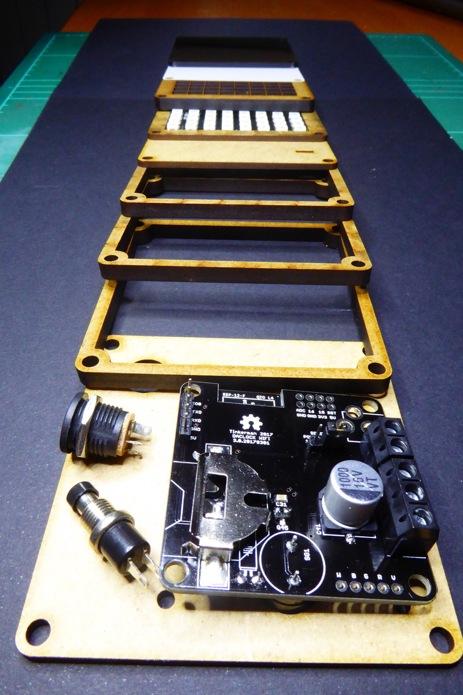

# Slices

Slices is an ESP8266 based clock with a LED matrix display.

It's an evolution of a previous project ([a wordclock](http://tinkerman.cat/wordlock)), with the following goals:

* Replace the ATMega328P with an ESP8266 (NTP support and user interaction)
* Smaller sizes (8x8 LED matrices)
* Smaller PCB, less buttons (version 3.0 of the [DaClock](http://github.com/xoseperez/daclock) board)
* Add buzzer for alarms
* Replace the 3D printed part with a MDF grid cut in laser
* Completely closed enclosure, better presentation
* Fix some issues with the original board (like the lack of a beefy capacitor across the LED matrix power lines).


## Hardware

### The clock

The hardware has been designed using [OpenSCad](http://www.openscad.org)
and it's inspired by the [PiBow](https://www.raspberrypi.org/blog/pibow/)
cases for Raspberry Pi. A series of layers forming a sandwich. From top to bottom
the layers are (this is true for beta version):

* front, a smoke colored acrylic layer cut with a laser cutter
* stencil (optional), a thin black cardboard with the characters cut out with a laser
* diffusor, a thin white paper sheet
* grid, a 3D printed black PLA grid to isolate each pixel or a thick laser cut MDF
* LED matrix, a 16x16 flexible RGB LED Matrix or a 8x8 PCB based one w/ WS2812B pixels
* LED matrix support in MDF
* MDF hollow layers to allow room for the electronics
* controller, custom PCB attached to the backend
* back, a clear acrylic layer or MDF again with holes for the power connector and button



### The controller

The controller is based on the the [DaClock](http://github.com/xoseperez/daclock)
board and it's designed to serve different purposes. This project uses version 3.0
of that board.

It features a ESP8266 ESP12E/F module, a DS1337 RTC clock, a buzzer for notifications
and connectors to drive a WS2812 LED matrix.

## Firmware

The project is ready to be build using [PlatformIO](http://www.platformio.org).
Please refer to their web page for instructions on how to install the builder.
Once installed:

```bash
> cd code
> platformio run
> platformio run --target upload
```

Library dependencies are automatically managed via PlatformIO Library Manager.
